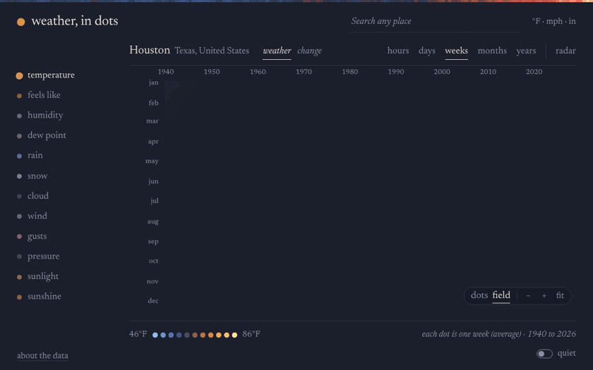
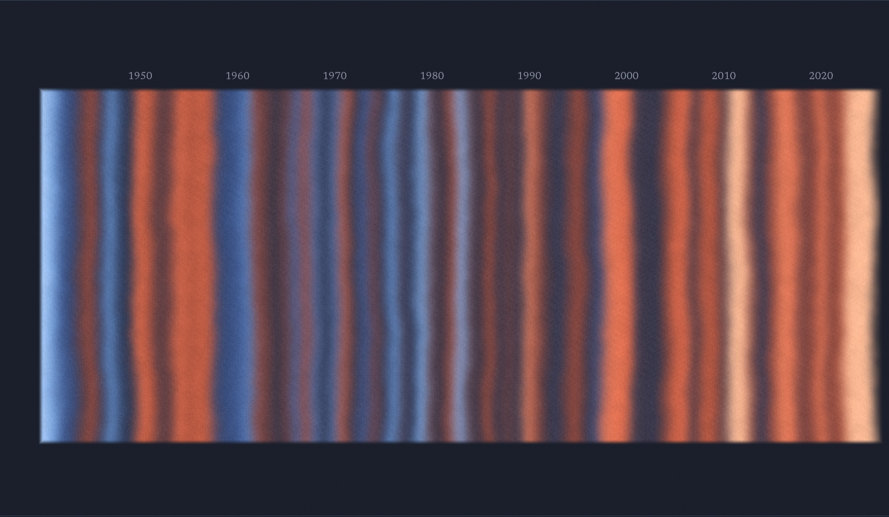
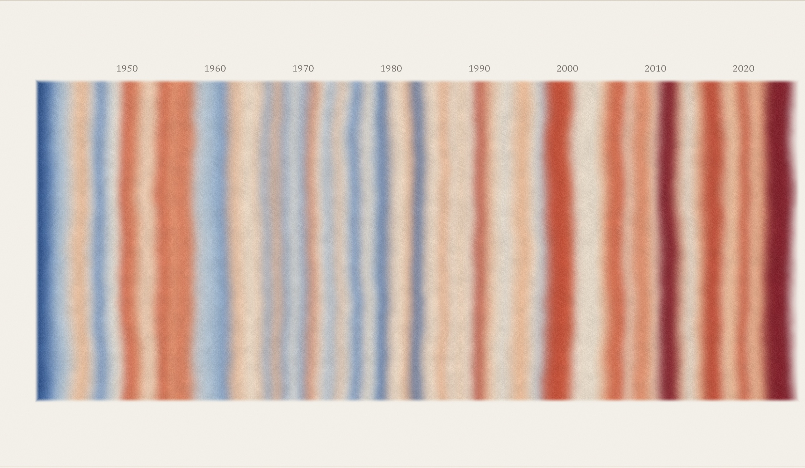
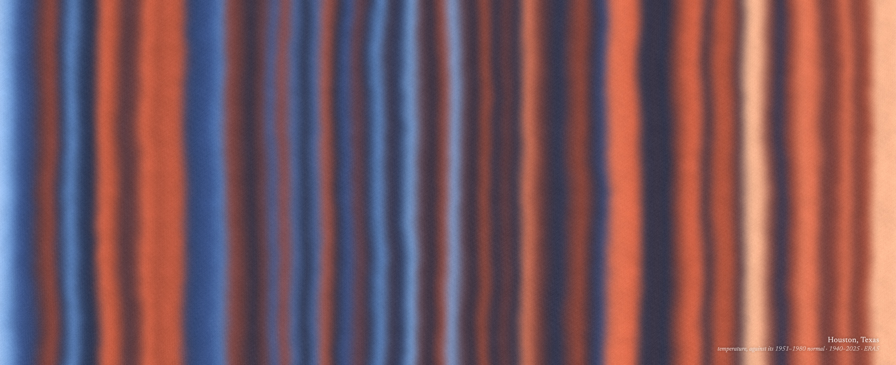

# weather, in dots

Eighty-six years of weather for any place on earth, and how far it has drifted from normal.



**Try it: [chrisqtruong.github.io/weather-in-dots](https://chrisqtruong.github.io/weather-in-dots/)**

Search for a place and pick one of twelve measures. Every hour of the past year, or every day, week, month or year since 1940, becomes a patch of colour. You can zoom from a single afternoon out to the whole record.

- **weather / change.** *Weather* colours each cell by the value itself. *Change* colours it by how far it sat from the same time of year in 1951–1980, the baseline NASA uses for its global temperature record. One line underneath sums it up, for example *2016–2025: +1.7°F against 1951–1980*.
- **years as warming stripes.** One column per year, after the climate scientist [Ed Hawkins](https://showyourstripes.info/).
- **field / dots.** *Field* lets neighbouring cells bleed into each other like pigment, so slow patterns show through the week-to-week noise. It drifts very slowly and has a fine print grain. *Dots* shows every value exactly, as hand-drawn dots.
- **the planet.** The hairline across the top of the page is the whole Earth, every year since 1850, from NOAA. Hover over it to read a year.
- **quiet.** On by default. The controls step away and the picture fills the page, with only the place, one line about what you're seeing, and the summary left. You can still hover to read any value. The switch in the top-right corner says whether it's on; it (or the Q key) turns it off, and so does clicking the place name, which also opens search.
- **save image.** The button at the top (or the S key) draws whatever you're looking at again, at about 3,600 px across, and signs it small in the corner, the way a print is signed: the place, then one italic line with the measure, the years and the source, in a tint of the colours underneath. Very wide or very tall views are set on a paper mat, like a matted print. You get a preview with the file type (JPEG or PNG), pixel size and file size before anything downloads.
- **radar.** The last two hours of rain, drawn as dots on a quiet, labelled map.

| Houston, one stripe per year, against 1951–1980 | |
|---|---|
|  |  |

A saved image:



## Why

Data often says the most when you can watch it over time. One hot week is just weather. Eighty-six years of weeks side by side start to tell a story.

## The twelve measures

temperature · feels like · humidity · dew point · rain · snow · cloud · wind · gusts · pressure · sunlight · sunshine

Each has its own colour ramp. Colours stretch across each place's own range, so every city shows its texture. The trade-off is that a deep orange in Fairbanks is not the same heat as one in Houston.

## Where the data comes from

- **The planet:** [NOAA NCEI Climate at a Glance](https://www.ncei.noaa.gov/access/monitoring/climate-at-a-glance/global/time-series), global land and ocean temperature departures since 1850. A saved copy (`media/planet-noaa.json`) is used if NOAA can't be reached.
- **History:** [ERA5](https://www.ecmwf.int/en/forecasts/dataset/ecmwf-reanalysis-v5), the reanalysis from the European Centre for Medium-Range Weather Forecasts for the [Copernicus Climate Change Service](https://climate.copernicus.eu/). It rebuilds every hour since 1940 from stations, balloons, ships and satellites, on a grid about 25 km across. Served free by [Open-Meteo](https://open-meteo.com/).
- **Radar:** national weather radars, combined by [RainViewer](https://www.rainviewer.com/).
- **Map:** [Esri](https://www.esri.com/)'s grey canvas basemap (HERE, Garmin, © [OpenStreetMap](https://www.openstreetmap.org/copyright) contributors), drawn with [Leaflet](https://leafletjs.com/).
- **Place search:** [GeoNames](https://www.geonames.org/), through Open-Meteo's geocoding API.

Open-Meteo's free tier is for non-commercial use and has rate limits. Eighty-six years of daily data is a heavy request, so everything the page fetches is saved in your browser (IndexedDB). A place you've opened before loads instantly and costs nothing. If you hit the hourly limit, the page tells you; wait a bit and try again.

## Run it yourself

It's plain HTML, CSS and JavaScript, with WebGL2 for the field. There's no build step, no framework and no API keys, and the whole app is about 80 KB before compression.

```
git clone https://github.com/chrisqtruong/weather-in-dots.git
cd weather-in-dots
python3 serve.py
```

Then open http://localhost:4322. Any static file server works too.

When releasing, bump the `?v=` number on the scripts and stylesheet in `index.html`, so browsers don't mix a cached old script with the new page.

| File | What it does |
|---|---|
| `index.html`, `style.css` | The page |
| `app.js` | Fetching, caching, the dot grids, zoom and hover |
| `field.js` | The field: a WebGL2 shader that blends, drifts and grains the grid |
| `planet.js` | The planet hairline, from NOAA |
| `radar.js` | The radar view: reads radar tiles and redraws them as dots |
| `tools/record.js` | Records the demo clip and stills with Playwright and a fake clock, from saved data |
| `tools/mkgif.swift` | Joins the recorded frames into a GIF (macOS) |

## Further reading

- [Climate Pulse](https://pulse.climate.copernicus.eu/): daily global temperatures from the same ERA5 data
- [#ShowYourStripes](https://showyourstripes.info/): Ed Hawkins's warming stripes, a close cousin of the years view
- [IPCC AR6 Synthesis Report](https://www.ipcc.ch/report/ar6/syr/)
- [Carbon Brief](https://www.carbonbrief.org/), [Inside Climate News](https://insideclimatenews.org/), [Grist](https://grist.org/)
- [Climate Justice Alliance](https://climatejusticealliance.org/)
- Giorgia Lupi, [Data Humanism](https://medium.com/@giorgialupi/data-humanism-the-revolution-will-be-visualized-31486a30dbfb)

## License

MIT. Made by [Chris Truong](https://github.com/chrisqtruong) with [Claude Code](https://claude.com/claude-code).
