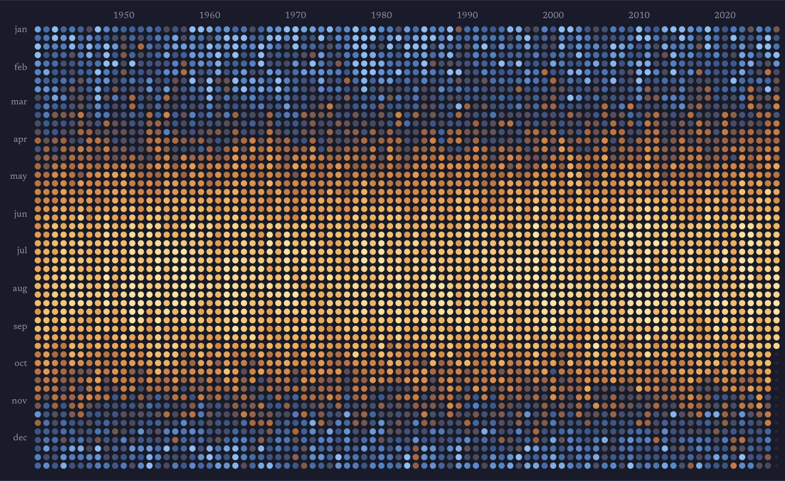
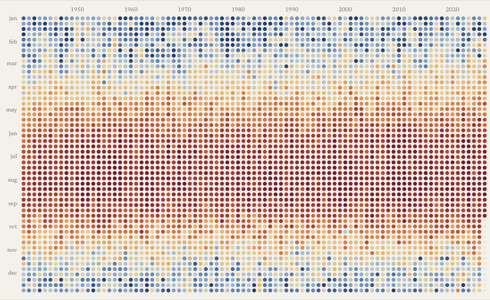

# weather, in dots

Eighty-six years of weather for any place on earth, one dot at a time.


**Try it: [chrisqtruong.github.io/weather-in-dots](https://chrisqtruong.github.io/weather-in-dots/)**

Search for a place, pick one of twelve measures, and the weather shows up as a field of coloured dots: one per hour for the past year, or one per day, week, month or year going back to 1940. Zoom in until each dot is a single afternoon. Zoom out until a whole decade is a row of ten. Hover over a dot to read its number.

There's also a **radar** view: the last two hours of rain, drawn as dots on a quiet, labelled map, looping like a doppler.

## Why

I wanted something calm to look at that still tells the truth. Laid out like this, the seasons look like weather, and the changes underneath them look like climate: summers stretching into October, warm years piling up since 2010. Those changes reach everyone, but not equally. Heat, drought and flooding fall hardest on poorer neighbourhoods and countries, and on the people who did least to cause them.

| Houston, one dot per week | |
|---|---|
|  |  |

## The twelve measures

temperature · feels like · humidity · dew point · rain · snow · cloud · wind · gusts · pressure · sunlight · sunshine

Each has its own colour ramp. Colours stretch across each place's own range, so every city shows its texture. The trade-off is that a deep orange in Fairbanks is not the same heat as one in Houston.

## Where the data comes from

- **History:** [ERA5](https://www.ecmwf.int/en/forecasts/dataset/ecmwf-reanalysis-v5), the reanalysis from the European Centre for Medium-Range Weather Forecasts for the [Copernicus Climate Change Service](https://climate.copernicus.eu/). It rebuilds every hour since 1940 from stations, balloons, ships and satellites, on a grid about 25 km across. Served free by [Open-Meteo](https://open-meteo.com/).
- **Radar:** national weather radars, combined by [RainViewer](https://www.rainviewer.com/).
- **Map:** [Esri](https://www.esri.com/)'s grey canvas basemap (HERE, Garmin, © [OpenStreetMap](https://www.openstreetmap.org/copyright) contributors), drawn with [Leaflet](https://leafletjs.com/).
- **Place search:** [GeoNames](https://www.geonames.org/), through Open-Meteo's geocoding API.

Open-Meteo's free tier is for non-commercial use and has rate limits. Eighty-six years of daily data is a heavy request, so everything the page fetches is saved in your browser (IndexedDB). A place you've opened before loads instantly and costs nothing. If you hit the hourly limit, the page tells you; wait a bit and try again.

## Run it yourself

It's plain HTML, CSS and JavaScript, with no build step and no API keys.

```
git clone https://github.com/chrisqtruong/weather-in-dots.git
cd weather-in-dots
python3 serve.py
```

Then open http://localhost:4322. Any static file server works too.

| File | What it does |
|---|---|
| `index.html`, `style.css` | The page |
| `app.js` | Fetching, caching, the dot grids, zoom and hover |
| `radar.js` | The radar view: reads radar tiles and redraws them as dots |
| `tools/record.js` | Records the demo clip with Playwright, from saved data |
| `tools/mkgif.swift` | Joins the recorded frames into a GIF (macOS) |

## Further reading

- [Climate Pulse](https://pulse.climate.copernicus.eu/): daily global temperatures from the same ERA5 data
- [#ShowYourStripes](https://showyourstripes.info/): Ed Hawkins's warming stripes, a close cousin of the years view
- [IPCC AR6 Synthesis Report](https://www.ipcc.ch/report/ar6/syr/)
- [Carbon Brief](https://www.carbonbrief.org/), [Inside Climate News](https://insideclimatenews.org/), [Grist](https://grist.org/)
- [Climate Justice Alliance](https://climatejusticealliance.org/)
- Giorgia Lupi, [Data Humanism](https://medium.com/@giorgialupi/data-humanism-the-revolution-will-be-visualized-31486a30dbfb)

## License

MIT. Made by [Chris Truong](https://github.com/chrisqtruong) with [Claude Code](https://claude.com/claude-code).
